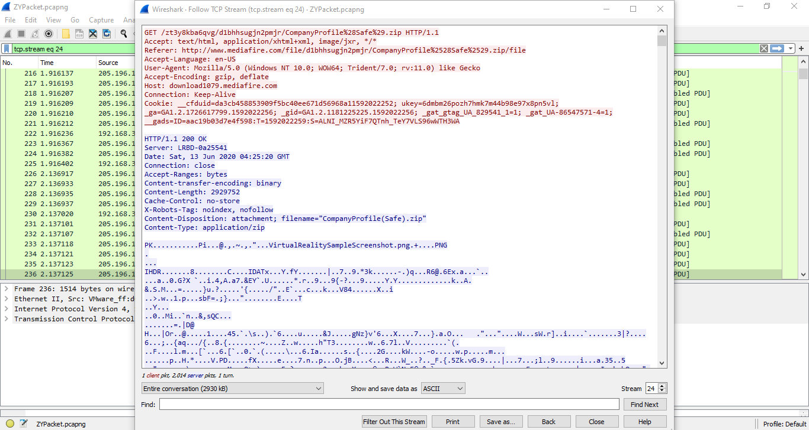
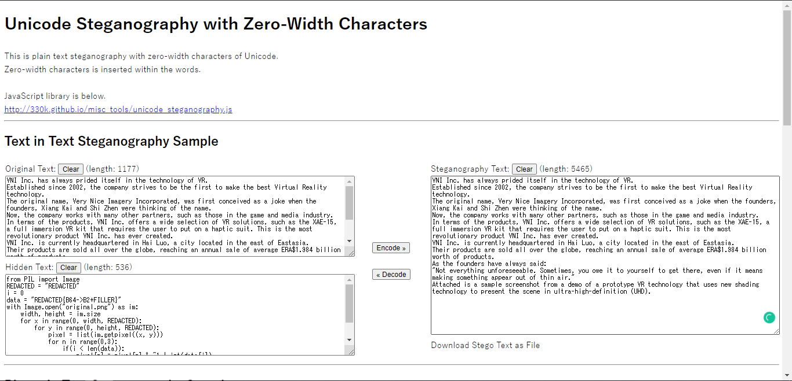

# IRS Internal CTF

## Special Stego IV - Sunset and Mountains (itszzjj) [200 points]

Zhong Yang managed to infiltrate into VNI Inc., which turned out to be actually abusing its monopoly power by threatening other companies in the same market in addition to its façade of VR technology innovation. 

Due to the heightened security in this company due to the recent exploit leaks, Zhong Yang was forced to hide the data in a really peculiar way into this unsuspecting image he recently downloaded from online, passing it off as a prototype screenshot, along with a company description. 

Luckily, the data packet he sent was passed by security and reached us.

 Uncover what Zhong Yang sent.

### The Packet

________

This challenge complicates things by having the data placed within the packet file. However, this is not too difficult to extract it.

We can open it with Wireshark, follow the TCP stream with the data Zhong Yang sent (TCP stream 24), and save the data stream as raw data.



With `binwalk`, the ZIP file can be carved out.

```bash
$ binwalk -e data24

DECIMAL       HEXADECIMAL     DESCRIPTION
--------------------------------------------------------------------------------
146           0x92            Unix path: /www.mediafire.com/file/d1bhhsugjn2pmjr/CompanyProfile%2528Safe%2529.zip/file
1055          0x41F           Zip archive data, at least v2.0 to extract, compressed size: 2927424, uncompressed size: 2926974, name: VirtualRealitySampleScreenshot.png
2928543       0x2CAF9F        Zip archive data, at least v2.0 to extract, compressed size: 1956, uncompressed size: 14041, name: CompanyProfileDescription.txt
2930785       0x2CB861        End of Zip archive
```

In the ZIP file, we are given two things: 

`VirtualRealitySampleScreenshot.png`


`CompanyProfileDescription.txt`


It is evident that Zhong Yang was trying to pass this off as a seemingly normal advertisement. This means that there is something hidden in plain sight.

The first clue lies in `CompanyProfileDescription.txt`. Doing a quick `xxd` dump will reveal this.

```
00000000: 564e 49e2 808c e280 8ce2 808c e280 8ce2  VNI.............
00000010: 808d e280 ace2 808d e280 ace2 808c e280  ................
00000020: 8ce2 808c e280 8ce2 808d efbb bfe2 808c  ................
00000030: e280 ac20 496e 63e2 808c e280 8ce2 808c  ... Inc.........
00000040: e280 8ce2 808d e280 acef bbbf efbb bfe2  ................
00000050: 808c e280 8ce2 808c e280 8ce2 808d e280  ................
00000060: acef bbbf e280 8d2e e280 8ce2 808c e280  ................
00000070: 8ce2 808c e280 8ce2 80ac e280 8ce2 808c  ................
00000080: e280 8ce2 808c e280 8ce2 808c e280 8de2  ................
00000090: 808d e280 8ce2 808c 2068 6173 e280 8ce2  ........ has....
000000a0: 808c e280 8ce2 808c e280 8de2 808c e280  ................
000000b0: ace2 808d 2061 6c77 6179 73e2 808c e280  .... always.....
000000c0: 8ce2 808c e280 8ce2 808d e280 8cef bbbf  ................
000000d0: e280 8c20 7072 6964 6564 20e2 808c e280  ... prided .....
000000e0: 8ce2 808c e280 8ce2 808c e280 ace2 808c  ................
000000f0: e280 8c69 7473 656c 66e2 808c e280 8ce2  ...itself.......
00000100: 808c e280 8ce2 808d e280 ace2 80ac e280  ................
00000110: 8d20 696e e280 8ce2 808c e280 8ce2 808c  . in............
00000120: e280 8de2 80ac efbb bfe2 808d e280 8ce2  ................
00000130: 808c e280 8ce2 808c e280 8def bbbf e280  ................
00000140: 8ce2 808c 2074 6865 20e2 808c e280 8ce2  .... the .......
00000150: 808c e280 8ce2 808d e280 acef bbbf efbb  ................
00000160: bf74 6563 686e 6f6c 6f67 7920 e280 8ce2  .technology ....
00000170: 808c e280 8ce2 808c e280 8def bbbf e280  ................
00000180: 8ce2 80ac e280 8ce2 808c e280 8ce2 808c  ................
.
.
.
```

There are zero width characters embedded within the company description!

Using this [website](https://330k.github.io/misc_tools/unicode_steganography.html), we can obtain the following script:



```python
from PIL import Image
REDACTED = "REDACTED"
i = 0
data = "REDACTED{B64->B2+FILLER}"
with Image.open("original.png") as im:
    width, height = im.size
    for x in range(0, width, REDACTED):
        for y in range(0, height, REDACTED):
            pixel = list(im.getpixel((x, y)))
            for n in range(0,3):
                if(i < len(data)):
                    pixel[n] = pixel[n] & ~1 | int(data[i])
                    i+=1
            im.putpixel((x,y), tuple(pixel))
    im.save("VirtualRealitySampleScreenshot.png", "PNG")
```

From the code, it is likely that the original flag data was encoded first to Base64, then subsequently converted to binary. Thereafter, the least significant bit of every `REDACTED` pixel is modified in this way:

1. `pixel[n] = pixel[n] & ~1` clears out the least significant bit.
2. `| int(data[i])` places a `1` when the binary string happens to have a `1` at that position. Otherwise, it remains at `0`.

To read a LSB, we can use a bitwise AND `&1`. However, the LSB for this challenge is customised in that the encoder skips every certain step size of pixels before modifying the LSB of a pixel. This value of step size is labelled `REDACTED`. 

Therefore, the way to solve it is to brute force a range of possible `REDACTED` values, decode binary and subsequently Base64 to obtain the flag.

The data encoded had taken into account the additional filler added, so there should not be any decoding error when the right step size is chosen. However, the rest of the picture is not modified as such. Hence, to counteract this, we use a `try` and `except` block within a `for` loop, and for every error the script receives, it should simply disregard it and continue.

With that said, here is the decoder script:

```python
from PIL import Image
import base64
with Image.open("VirtualRealitySampleScreenshot.png") as im:
    width, height = im.size
    byte = []
    for z in range(1, 1921):
        extracted = []
        try:
            print(z)
            for x in range(0, width, z):
                for y in range(0, height, z):
                    pixel = list(im.getpixel((x, y)))
                    for n in range(0,3):
                        extracted.append(pixel[n]&1)
            data = "".join([str(x) for x in extracted]) 
            chars = []
            for i in range(int(len(data)/8)):
                byte = data[i*8:(i+1)*8]
                chars.append(chr(int(''.join([str(bit) for bit in byte]), 2)))     
            output = base64.b64decode(''.join(chars))
            print(output)
        except:
            continue
```

Running it with `VirtualRealitySampleScreenshot.png` will yield the flag at step size 85.

```
75
76
77
78
79
80
81
82
83
84
85
b'IRS{Sp3c1AL_L5B_15_alwAy5_v3rY_fuN_AnD_c00l!_G00d_j0b_W3LL_d0n3!}'
86
87
88
89
90
91
92
93
94
95
96
97
98
99
100
```


### Flag

__________

```
IRS{Sp3c1AL_L5B_15_alwAy5_v3rY_fuN_AnD_c00l!_G00d_j0b_W3LL_d0n3!}
```

