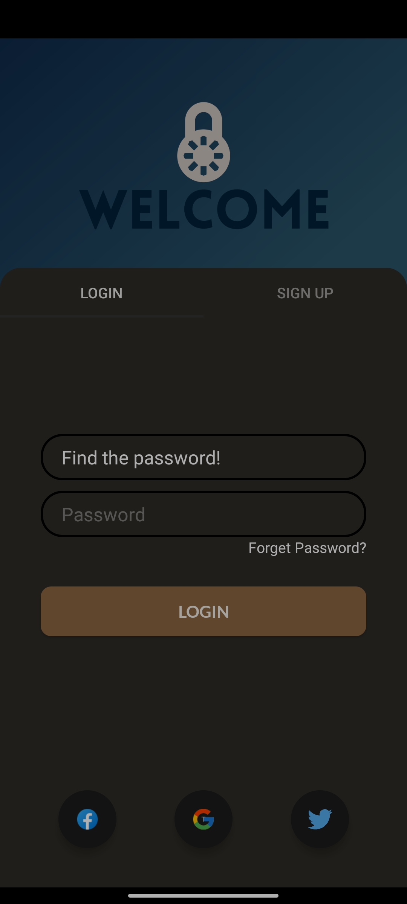

# True or false!

**2000 Points // 11 Solves**


## Description

True or false, we can log in as admin easily.


## Solution

This challenge corresponds to the "Admin Login" page.



It seems that only a password is needed to be entered to login. The Forget Password button gives us a hint `Hint: 32 characters with special characters and spaces. TABLE name: Users, password column: you know it! :) ` suggesting that database is used and brute force is not possible. The Sign up part has no use.


Extracting the database from the device we will realise that it is encrypted. Either we have to find the password of the database or we need to find the flag directly from the code. Both ways are actually possible.


Look into the code of `AdminAuthenticationActivity`, it leads us to an obfuscated class `f.a.a.a.a.a.a` .  Here, we will find the following logic. 

```
 iget-object v0, p0, Lf/a/a/a/a/a/a$b;->d:Lf/a/a/a/a/a/a;

    iget-object v0, v0, Lf/a/a/a/a/a/a;->c:Landroid/widget/EditText;

    invoke-virtual {v0}, Landroid/widget/EditText;->getText()Landroid/text/Editable;

    move-result-object v0

    invoke-virtual {v0}, Ljava/lang/Object;->toString()Ljava/lang/String;

    move-result-object v0

    .line 75
    .local v0, "password":Ljava/lang/String;
    const-wide v1, -0xcfa48aafb8L

    invoke-static {v1, v2}, Lc/a/a/a;->a(J)Ljava/lang/String;

    move-result-object v1

    invoke-virtual {v0, v1}, Ljava/lang/String;->contains(Ljava/lang/CharSequence;)Z

    move-result v1

    if-eqz v1, :cond_8b

```

The password is compared with the return value from `c.a.a.a.a(-0xcfa48aafb8L)` `c.a.a.a.a` is actually the function for decryption of strings in the application. Copy the whole `c.a.a.a` class and run the function with the parameter mentioned above gives us `My_P@s5w0Rd_iS-L34k3d_AG41n! T_T`, which is the password.


Alternatively, we can extract the password of the database using the same method and we will get the same password in the database. 


Enter the password and we can get the flag.


## Flag

`govtech-csg{It5_N0T_Ez_2_L0G_1n_S_AdM1n}`

