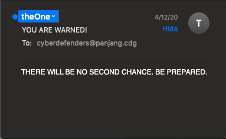
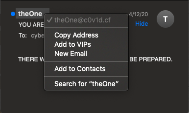
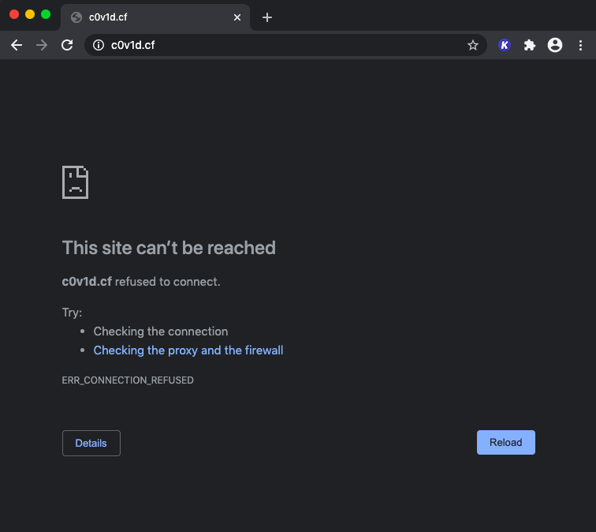
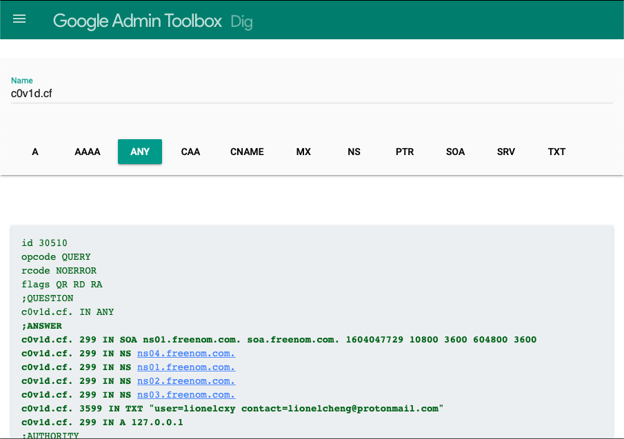
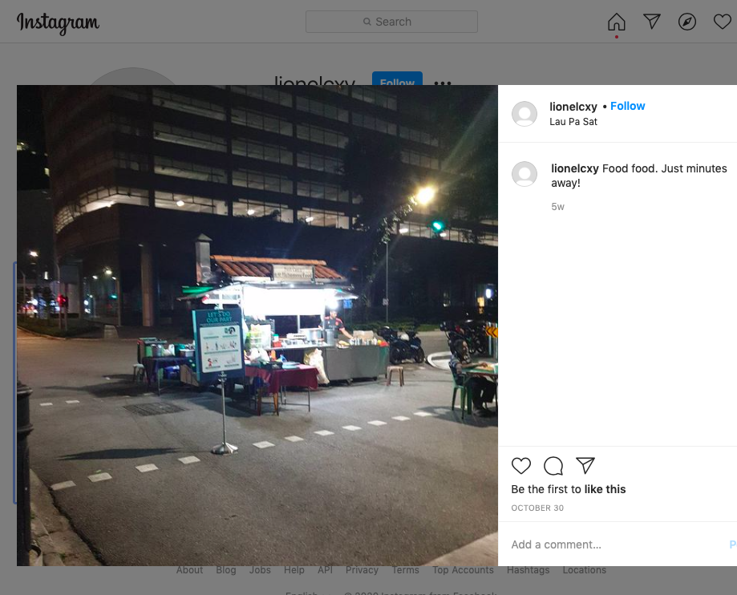
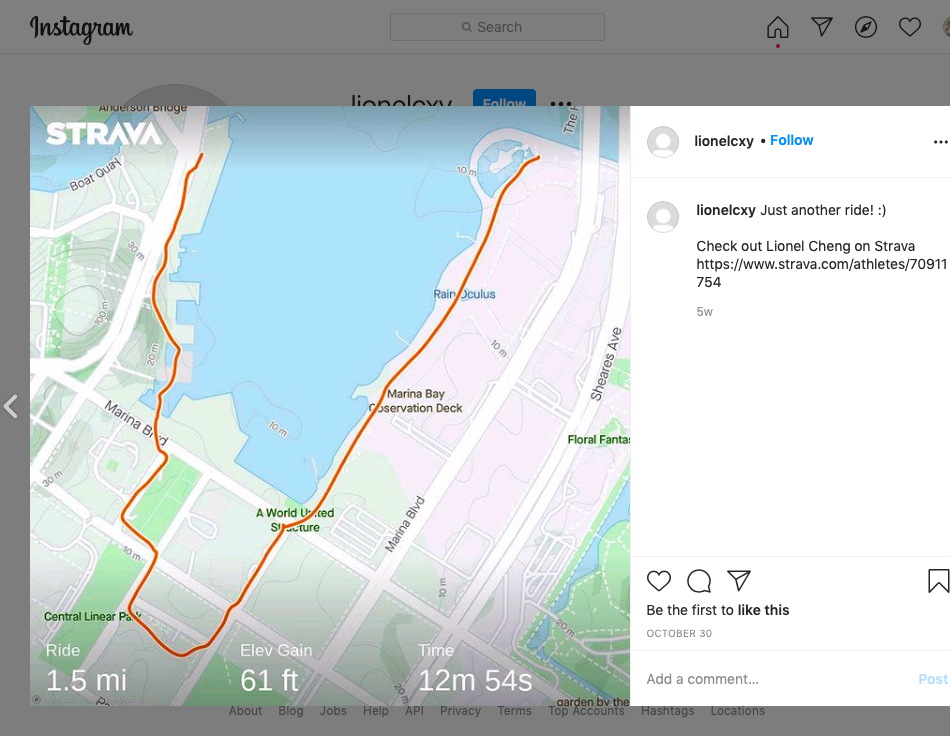
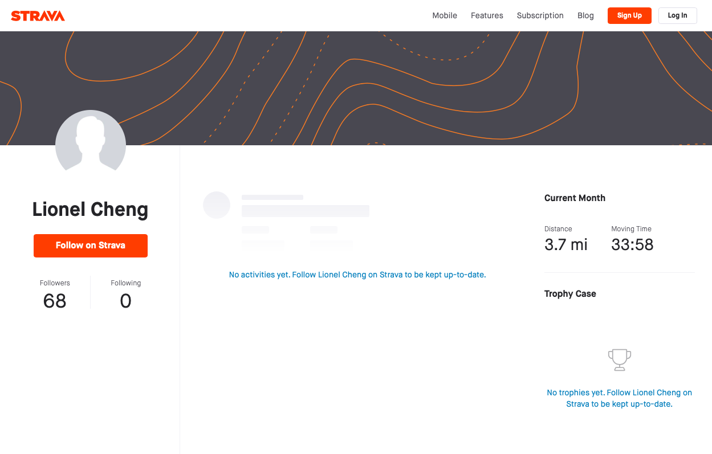
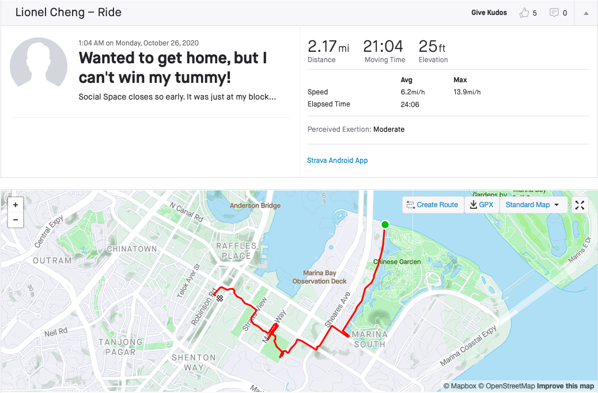

# Hunt Him Down (OSINT)

**970 Points // 14 Solves**

## Description

After solving the past two incidents, COViD sent a death threat via email today. Can you help us investigate the origins of the email and identify the suspect that is working for COViD? We will need as much information as possible so that we can perform our arrest! 

Example Flag: govtech-csg{JohnLeeHaoHao-123456789-888888} 

*Flag Format: govtech-csg{fullname-phone number[9digits]-residential postal code[6digits]}* 


## Email

We are given a `.eml` file.

> **EML**, short for electronic mail or email, is a **file** extension for an email message saved to a **file** in the Internet Message Format protocol for electronic mail messages. It is the standard format used by Microsoft Outlook Express as well as some other email programs.


 which opens up to give us this:




Checking the sender, we see this email address:




Evidently, we will need to OSINT the email `theOne@c0v1d.cf`.

There are 2 ways we could approach this, 

1. Through `theOne` 
2. Through `c0v1d.cf`

In the first case, we are assuming that `theOne` is the sender's choice of username. In this case it is unlikely however since `theOne` is rather generic. For the second method, we know from the email that `c0v1d.cf` is a domain, since 

> The format of an email address is local-part@domain


Directly attempting to connect to `c0v1d.cf` gives us an error message:



so directly connecting to it is not the solution.


## DNS Lookup

Since know the domain name and want to find information about it, we should perform a [DNS](https://ns1.com/resources/what-is-dns) Lookup through `Dig` (Domain Information Groper).

> Domain Name Server (DNS) is a standard protocol that helps Internet users discover websites using human readable addresses. Like a phonebook which lets you look up the name of a person and discover their number, DNS lets you type the address of a website and automatically discover the Internet Protocol (IP) address for that website.


The tool we used was [this](https://toolbox.googleapps.com/apps/dig/) by Google Admin Toolbox. Inputting `c0v1d.cf` into the blank, we see this:


The settings basically switches around the [types of DNS Record](https://en.wikipedia.org/wiki/List_of_DNS_record_types). The one we want generally is  `ANY`, because it lists the DNS Records of  `ANY ` type. (It can be incomplete though, so check through the others if  `ANY` yields nothing useful.)




We see "user=lionelcxy contact=lionelcheng@protonmail.com". Evidently we want to OSINT this person.  `lionelcxy` is a username this person uses (since it is given in `user=lionelcxy`) and so is likely to be his preferred username, while `lionelcheng@protonmail.com` is his email.


## Sherlock

Since we now have this username `lionelcxy` and email `lionelcheng@protonmail.com`, we want to find information on this person. 


Just a quick google with his email gives us his LinkedIn, which gives us his fullname.


(so, his fullname is LionelChengXiangYi, the format is as hinted in the example flag)


The next part is where [sherlock](https://github.com/sherlock-project/sherlock) comes in. 

Since we have his username, `sherlock` is a good tool to use as it searches a very wide range of social media sites for this handle and outputs the list of profiles with this handle. In this case, `sherlock` wasn't really necessary but it is still rather quick, thus saving time. It is an especially good tool when the social media platform wanted is less obvious, like for a challenge involving Trello we had done recently.

```
$ python3 sherlock lionelcxy
[*] Checking username lionelcxy on:
[+] 500px: https://500px.com/p/lionelcxy
[+] ICQ: https://icq.im/lionelcxy
[+] Instagram: https://www.instagram.com/lionelcxy
[+] Telegram: https://t.me/lionelcxy
[+] Travellerspoint: https://www.travellerspoint.com/users/lionelcxy
[+] Twitter: https://mobile.twitter.com/lionelcxy
```

(Some of these links can be erroneous though!)


The working links are Instagram, Twitter and Telegram. The former 2 are probably more relevant here due to the nature of the sites. 


## Postal Code

This is his Instagram. 


The first post tells us he lives near Lau Pa Sat




The second is gives us his Strava account.




His Strava account doesn't seem to have anything.



But it seems rather weird that there is no activities but there are records on Distance and Moving Time, so we decided to follow his account to see if there's any follower-only information.


We see 2 entries here and the first seems especially relevant since it's about getting home and we want to find his residential postal code.



*Social Space closes so early. It was just at my block...*


He lives at a block with a 'Social Space', googling which tells us it is a store. 


There are 2 outlets there. The phrasing of *Social Space closes so early. It was just at my block...*. sounds like he had passsed by Social Space in his trip and  both his routes passed by the Marine One outlet. The Marine One outlet is also nearer to Lau Pa Sat. Hence we concluded his postal code is probably Singapore 018935.


## Phone Number

Since we've combed through both his Instagram and Strava, we moved on to his other social media account Twitter.


This part was rather straightforward and his phone number is 963672918.


## Flag

Combining these pieces of information, the flag is `govtech-csg{LionelChengXiangYi_963672918_018935}`.

