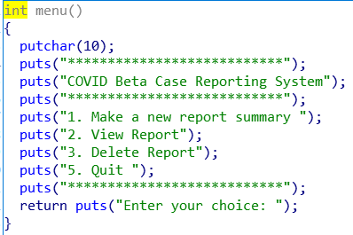
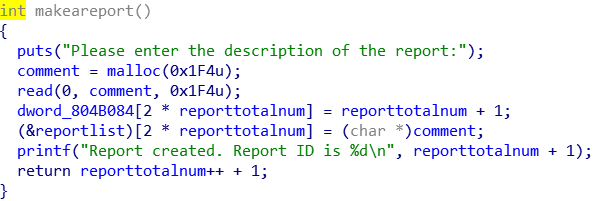

# Beta Reporting
**994 Points // 4 Solves**

## Notice

Before I start this writeup, I would like to apologize to my team for not being able to succeed in this challenge during the CTF itself :<

This writeup is probably not eligible but I am writing it anyway to document what I have learned.

## Preliminary Reconnaissance
Upon receiving the binary, our first instinct should be, as always, to open the binary in GDB and run `checksec`.

We can see that:

- There is a stack canary (no buffer overflow for us) 
- There is an NX-bit (No-eXecute, stack memory cannot be executed). 
- There is partial RELRO, allowing us to write to .got.plt (explained later).

From my limited knowledge of pwn, this means that either of these attacks are likely:

- <u>ROP (requires ROP gadgets)
- ret2libc (My idea of libc attacks is very vague)
- GOT overwrite (technically .got.plt)</u>

Let's open IDA and see if any of these are our candidates...

### The Main Interface

- Notice that Option 4 is missing.

- Hmm, `magicfunction()`?

### Program Functions

- Basically,
    - Allocates 500 (0x1F4) bytes worth of space and reads your report (`comment`) into them.
    - Makes a reference to the `comment` under index 2*`reporttotalnum` of `reportlist`.
    - Someone would say something about a <u>heap exploit</u> but
        1. I'm pretty sure that can't happen cos no overflow.
        2. I know nothing about heap exploit.

- Basically,
    - Asks you for your `name` (256 bytes) and `printf`s it out.
        - You can't directly <u>Format String Exploit</u> this because the format string is already defined.
    - A mysterious `for` loop which writes something somewhere.
    - A `while` loop which asks you for `nptr` (i.e. your report number). In this while loop,
        1. `nptr` is converted into an integer `v1` (or barfs if you don't input something convertible to integer)
        2. If `v1 > 0`, prints the report with report number `v1`.
        3. I think you know what happens if `v1 <= 0`

- Basically,
    - This function is literally useless. 
    - There is no point finding out what it does.
    - Like, the `qmemcpy()` function is broken. WHY IS THE SOURCE "&"???

### Interesting Functions

- This `magic` variable is not defined elsewhere. 
- When converted to hex, it decodes to "FLAG". **Interesting.**

- Basically, our `win()` function.
    - Combined with what we know from `magicfunction()`, this function `read()`s and `printf()`s the flag.

### ROP Gadgets

### Results & Summary
We gathered most of what we needed from IDA and ropper. Our findings show that:

- We have:
    - `NX-bit`
    - `stack canary`
    - `partial RELRO`
    - `win()` function