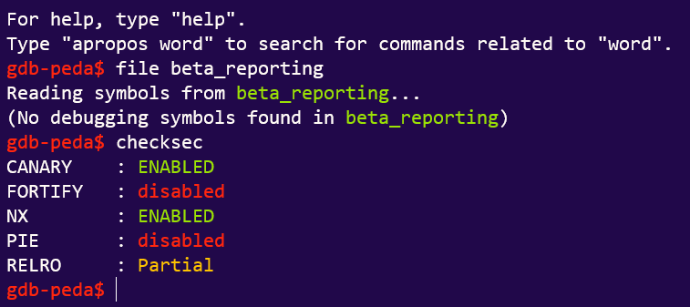

# Beta Reporting
**994 Points // 4 Solves**

## Notice

Before I start this writeup, I would like to apologize to my team for not being able to succeed in this challenge during the CTF itself :<

This writeup is probably not eligible but I am writing it anyway to document what I have learned.

## Preliminary Reconnaissance
Upon receiving the binary, our first instinct should be, as always, to open the binary in GDB and run `checksec`.

We can see that there is a stack canary (no buffer overflow for us) and NX (No-eXecute, stack memory cannot be executed). Of note is that there is partial RELRO, allowing us to write to .got.plt(explained later).

From my limited knowledge of pwn, this means that either of these attacks are likely:

- ROP
- ret2libc
- Overwriting .got.plt table with win function

Let's open IDA and see if any of these are our candidates...
